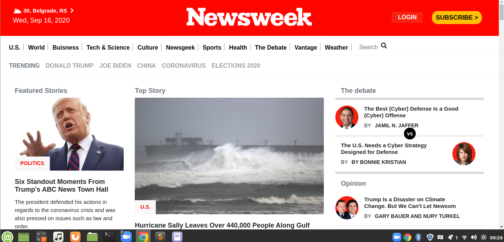

# Project Name
Newsweek Clone
This project is build with Bootstrap!

Additional description about the project and its features.

## Built With

- HTML and CSS
- Bootstrap
- technologies used

## Live Demo

[Live Demo Link](https://bigwizzo.github.io/newsweek-clone/)

## Getting Started

This project represents clone of Newsweek. To build it we used Bootstrap framework.

To get a local copy up and running follow these simple example steps.

### Prerequisites

### Setup

### Install

### Usage

### Run tests

### Deployment

## Authors

👤 Willard Nyamunokora

- Github: [@githubhandle](https://github.com/bigwizzo )
- Twitter: [@twitterhandle](https://twitter.com/willnyamunokora)
- Linkedin: [linkedin](https://www.linkedin.com/in/willnyamunokora)

👤 Andjela Vukadinovic

- Github: [@githubhandle](https://github.410AngelaVU)
- Twitter: [@twitterhandle](@andjelavukadinov7)
- Linkedin: [linkedin](https://linkedin.com/andjelavukadinov)

## 🤝 Contributing

Contributions, issues and feature requests are welcome!

Feel free to check the [issues page](issues/).

## Show your support

Give a ⭐️ if you like this project!

## Acknowledgments

- Hat tip to anyone whose code was used
- Inspiration
- etc

## 📝 License

This project is [MIT](lic.url) licensed.
